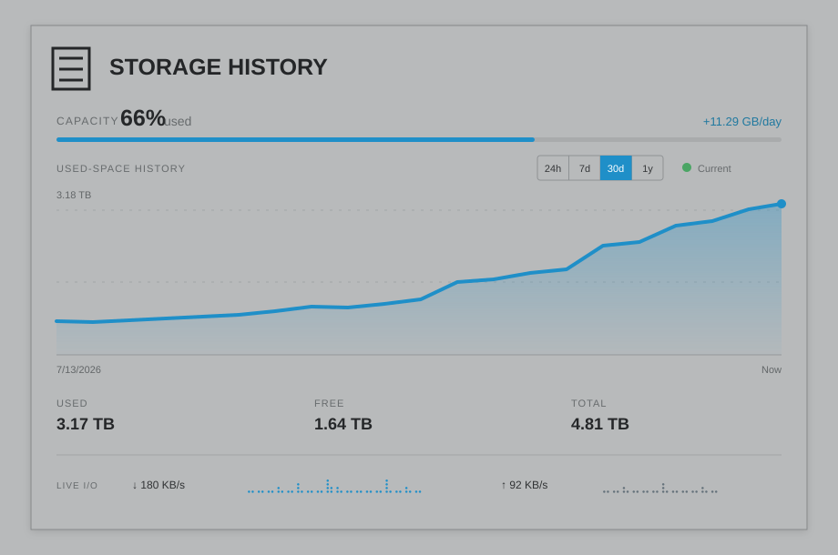

# Storage History

Storage History adds a native storage-capacity tile to the Unraid Dashboard. It records used, free, and total space over time without Docker or an external monitoring stack. Traditional arrays and pool-only systems are supported.



_Dashboard preview using representative values._

## Requirements

- Unraid 7.0 or newer
- A started array or mounted storage pool

## Features

- Adaptively scaled capacity history that makes normal storage changes visible
- Hover details for the date, used space, free space, and change from the previous sample
- 24-hour, 7-day, 30-day, and 1-year chart ranges
- Current used, free, and total capacity with a utilization strip
- Average daily growth and an estimated time remaining after at least seven days of positive-growth data in the selected range
- Live aggregate physical-disk read and write meters
- Current, Collecting, Stale, and Paused collection states
- Responsive, theme-aware styling designed for the native Dashboard

## Install

In Unraid, open **Plugins → Install Plugin** and paste this URL:

```text
https://raw.githubusercontent.com/rka/unraid-storage-history/main/storage-history.plg
```

After installation, use the Dashboard's **Content Manager** to position the **Storage History** tile. Configuration is available under **Settings → Storage History**.

## Configuration

- **Enable collection:** Pause or resume scheduled capacity samples.
- **Interval:** Choose from 15 minutes, 30 minutes, hourly, every 6 hours, every 12 hours, or daily.
- **Retention:** Keep between 30 and 1,825 days of samples; the default is 365 days.
- **Data path:** Store history under `/mnt`; the default is `/mnt/user/system/storage-history`.

The default data path keeps normal sampling writes off the USB boot device.

## Data and status

Capacity history is stored in `history.json` at the configured data path. Array values come from the same emhttp state used by Dynamix; on pool-only systems, mounted pool capacity is aggregated without double-counting pool members.

Live I/O is calculated from Linux disk statistics, retained only in memory by the open Dashboard, and resets when the page reloads. It is not written to capacity history.

Collection states mean:

- **Current:** Scheduled history is being collected normally.
- **Collecting:** Fewer than two capacity samples are available.
- **Stale:** The latest sample is substantially older than the configured interval.
- **Paused:** Collection is disabled in Settings.

## Updating and removing

Updates appear on Unraid's **Plugins** page and use the plugin's configured update URL. Removing the plugin deletes its runtime files and schedule but preserves configuration and historical data so they can be reused after reinstallation.

The plugin does not modify Dynamix or expose a network service. Sampling is skipped while storage capacity is unavailable.

## Support

Report problems or request features in [GitHub Issues](https://github.com/rka/unraid-storage-history/issues).
